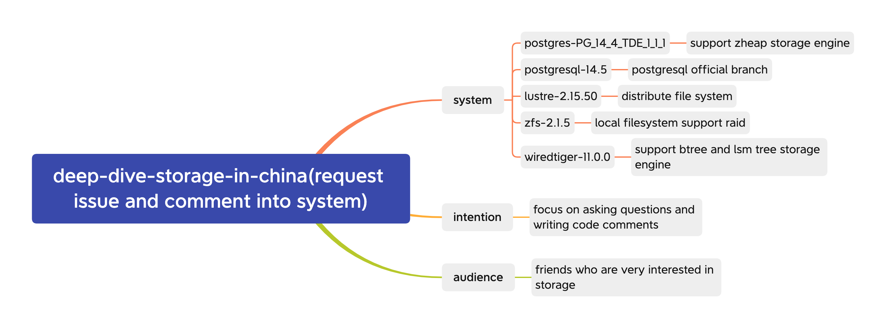

 ## deep-dive-storage-in-china


 ## 技术分享计划

### perrynzhou技术分享

|  主题   | 时间  | 文档  |
|  ----  | ----  |----  |
| 深入浅出Lustre Distributed Namespace特性  | 20220919 |https://github.com/perrynzhou/deep-dive-storage-in-china/tree/master/slideshare/perrynzhou/lustre |


### Zhongyl1994技术分享
|  主题   | 时间  | 文档  |
|  ----  | ----  |----  |
| todo  | todo |todo|


 ###  存储系统介绍



## 文档存放目录

```shell
[deep-dive-storage-in-china/slideshare]$ tree -L 3 ./
//  社区维护者文档目录名称
-- perrynzhou
    // lustre 相关文档
    |-- lustre
    |   -- Lustre\346\200\247\350\203\275\350\260\203\344\274\230-\344\270\212\347\257\207.pdf
    // zfs相关文档
    |-- zfs
        -- \346\267\261\345\205\245\347\220\206\350\247\243ZFS\346\226\207\344\273\266\347\263\273\347\273\237\345\237\272\347\241\200.pdf

3 directories, 2 files
```
## 交流渠道


